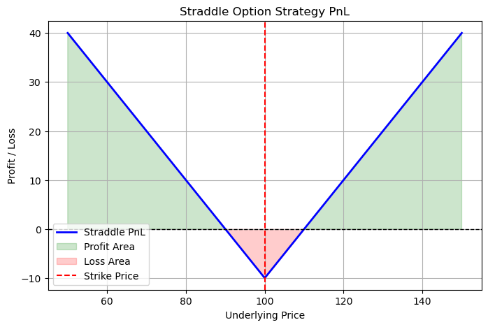
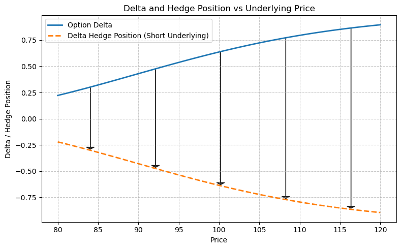
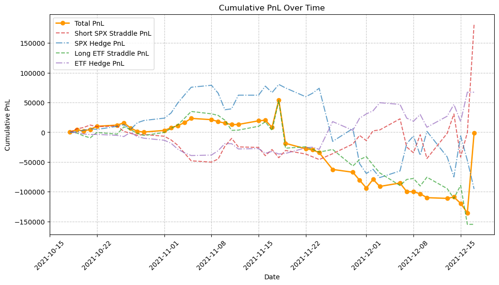

# Correlation Arbitrage

- [Introduce Correlation](#introduce-correlation)
- [Selection of Trading Assets](#selection-of-trading-assets)
- [Strategy Design & Execution](#strategy-design-execution)
- [Performance Analysis & Insights](#performance-analysis-insights)

## Introduce Correlation

- Pearson correlation coefficient:
    $$\rho_{X, Y} = \dfrac{\text{Cov}(X, Y)}{\sigma_{X}\sigma_{Y}}$$

    In statistics, the **Pearson correlation coefficient (PCC)** is a correlation coefficient that measures linear correlation between two sets of data. It is the ratio between the covariance of two variables and the product of their standard deviations; thus, it is essentially a normalized measurement of the covariance, such that the result always has a value between −1 and 1. [Wikipedia - Pearson Correlation Coefficient](https://en.wikipedia.org/wiki/Pearson_correlation_coefficient)

- Assume the index is composed of $N$ sectors, where each sector has a weight $w_{i}$. The variance of the index, $\sigma_{index}^{2}$ can be expressed in terms of the volatilities of its components and their correlations:

    $$\sigma_{index}^{2} = \sum w_{i}^{2} \sigma_{sector}^{2} + \sum_{i} \sum_{j \neq i} w_{i}w_{j} \sigma_{i}\sigma_{j} \rho_{i, j}$$

    where:
    - $\sigma_{index}^{2}$ is the total variance of the index.
    - $w_i$ is the weight of sector $i$ in the index.
    - $\sigma_{i}^2$ is the variance of sector $i$.
    - $\rho_{i, j}$ is the correlation between sector $i$ and sector $j$.

    We recall that covariance is related to correlation by:

    $$\text{Cov}(X, Y) = \sigma_{X}\sigma_{Y}\rho_{X, Y} $$

    Applying this to the index variance equation:

    $$\sigma_{index}^{2} = \sum w_{i}^{2} \sigma_{sector}^{2} + \sum_{i} \sum_{j \neq i} w_{i}w_{j} \text{Cov}(X_i, Y_j)$$

    Substituting $\text{Cov}(X_i, Y_j) = \sigma_{i}\sigma_{j} \rho_{i, j}$, we get:

    $$\sigma_{index}^{2} = \sum w_{i}^{2} \sigma_{sector}^{2} + \sum_{i} \sum_{j \neq i} w_{i}w_{j} \sigma_{i}\sigma_{j} \rho_{i, j}$$

    $$\sum_{i} \sum_{j \neq i} w_{i}w_{j} \sigma_{i}\sigma_{j} \rho_{i, j} = \sigma_{index}^{2} - \sum w_{i}^{2} \sigma_{sector}^{2}$$

    Using the standard correlation coefficient definition:

    $$\rho = \dfrac{\text{Cov(Index, Sectors)}}{\sigma_{index}\sigma_{sectors}}$$

    and applying the variance decomposition, we obtain:

    $$\rho = \dfrac{\sigma_{index}^{2} - \sum w_{i}^{2} \sigma_{sector}^{2}}{\sum_{i} \sum_{j \neq i} w_{i}w_{j} \sigma_{i}\sigma_{j}}$$

## Selection of Trading Assets

The trading strategy is based on the **S&P 500 Index (SPX)** and its **11 sector ETFs**, which represent different industries within the market. These sector ETFs serve as the underlying assets for constructing the correlation arbitrage trade. The sectors and their respective weights are as follows:

<table border="1" class="dataframe">
  <thead>
    <tr style="text-align: right;">
      <th>Sector</th>
      <th>Weight</th>
    </tr>
  </thead>
  <tbody>
    <tr>
      <td>XLK</td>
      <td>27.914488</td>
    </tr>
    <tr>
      <td>XLV</td>
      <td>12.692172</td>
    </tr>
    <tr>
      <td>XLY</td>
      <td>12.618698</td>
    </tr>
    <tr>
      <td>XLF</td>
      <td>11.499232</td>
    </tr>
    <tr>
      <td>XLC</td>
      <td>11.042944</td>
    </tr>
    <tr>
      <td>XLI</td>
      <td>8.127506</td>
    </tr>
    <tr>
      <td>XLP</td>
      <td>5.670948</td>
    </tr>
    <tr>
      <td>XLE</td>
      <td>2.924949</td>
    </tr>
    <tr>
      <td>XLRE</td>
      <td>2.579896</td>
    </tr>
    <tr>
      <td>XLB</td>
      <td>2.527329</td>
    </tr>
    <tr>
      <td>XLU</td>
      <td>2.401839</td>
    </tr>
  </tbody>
</table>

The trade is executed over the period **October 18, 2021** to **December 17, 2021**. 

## Strategy Design & Execution

### Why Use Straddles?
A straddle is a volatility-based options strategy that involves simultaneously buying or selling both an at-the-money (ATM) call and put on the same underlying asset. It is used in this strategy because:

1. Pure Volatility Exposure
    - A straddle’s profit and loss (PnL) depend primarily on the realized volatility of the underlying asset, rather than its price direction.
    - This allows us to isolate volatility mispricing rather than taking directional bets.
2. Capturing Dispersion Effects
    - Selling an SPX straddle provides exposure to index-level volatility, which tends to be lower than the volatility of its components due to diversification.
    - Buying sector straddles allows us to capture volatility at the sector level, which is typically higher than the overall index volatility when correlation declines.
3. Hedging Market Direction
    - Since straddles contain both call and put options, they provide a market-neutral exposure to volatility, reducing the need for complex directional hedging.

### Trading Logic: Short SPX Straddle + Long Sector Straddles
This strategy exploits the dispersion effect, where the volatility of individual sectors can be higher than the implied volatility of the overall index. We observed that **SPX implied volatility appears overpriced**, suggesting that **realized volatility will likely be lower than expected**. To capture this mispricing, we **short the SPX straddle** and **long the sector straddles**. The key ideas are:

1. Short 1,000 SPX Straddle (Selling Volatility at the Index Level)
    - Sell ATM straddle on SPX to collect premium from inflated implied volatility.
    - This expresses the view that SPX’s realized volatility will be lower than implied.
2. Long Sector Straddles – Buying Volatility at the Sector Level
    - Buy ATM straddles on 11 sector ETFs to gain exposure to sector-specific volatility.
    - When sector correlation decreases, sectors move independently. Realized volatility rises $\rightarrow$ long straddles become profitable.
3. Relationship to Correlation and Volatility

    The variance of the index is decomposed as: $\sigma_{index}^{2} = \sum w_{i}^{2} \sigma_{sector}^{2} + \sum_{i} \sum_{j \neq i} w_{i}w_{j} \sigma_{i} \sigma_{j} \rho_{i, j}$
    - If sector correlation ($\rho_{i, j}$) decreases, then even if sector volatilities increase, the index volatility does not increase proportionally.
    - This means that sector straddles can gain value while the SPX straddle remains stable or decreases in value, creating an arbitrage opportunity.

    Thus, the strategy profits when sector volatility rises more than expected, while index volatility remains suppressed.

### Portfolio Construction & Delta Hedging

#### Portfolio Construction
1. Short SPX ATM Straddle (betting that SPX volatility will stay lower than implied).
2. Long 11 ATM Straddles on Sector ETFs (betting that sector volatility will rise more than expected).
3. Delta-neutral hedging to maintain pure volatility exposure.

#### Delta Hedging
1. Since options positions gain delta exposure as the market moves, delta hedging is essential to ensure that the trade remains a **pure volatility bet** rather than a directional trade. 
2. By continuously adjusting the hedge, we ensure that the PnL is primarily driven by volatility movements, not market direction.
3. Frequent rebalancing is required to minimize exposure to large directional market shifts.

#### Conclusion
- Why use Straddles? $\rightarrow$ They allow pure volatility exposure without a directional bias.
- Trading Logic? $\rightarrow$ Short SPX Straddle bets on lower index volatility, while Long Sector Straddles capture dispersion effects.
- Portfolio Construction & Hedging? $\rightarrow$ Positions are sized based on sector weightings, and delta hedging ensures the trade remains a volatility arbitrage rather than a directional bet.

## Performance Analysis & Insights

### Volatility Comparison: Implied vs Realized
Throughout the trade period, the implied volatility (IV) of SPX options was 0.563, while the realized volatility (RV) observed at the end of the trade was 0.525.

The difference between implied and realized volatility was relatively small:

$$\text{Implied Vol} - \text{Realized Vol} = 0.038$$

This suggests that the market's pricing of volatility was fairly accurate, and there was no significant overpricing or underpricing of SPX volatility during the trade window.

### Impact on Strategy Performance
Since the strategy involved selling the SPX straddle (short volatility at the index level), a profitable outcome would typically require:
- Implied volatility **significantly higher** than realized volatility (to collect premium from overpricing), and/or
- Low correlation between sectors, increasing dispersion (benefiting long sector straddles).

However, given the modest gap between IV and RV, the strategy did not benefit meaningfully from volatility arbitrage, and dispersion was likely insufficient to offset the short SPX position.

### PnL Result
The final total portfolio PnL was:

$$\text{Total PnL} = -1399.83$$

### Conclusion
Although the strategy was structured correctly to capture volatility dispersion, the actual market conditions during the selected period — particularly the narrow spread between implied and realized volatility — resulted in a **modest loss**. This highlights the importance of **timing**, **correlation shifts**, and **volatility mispricing** in the success of dispersion-based arbitrage.